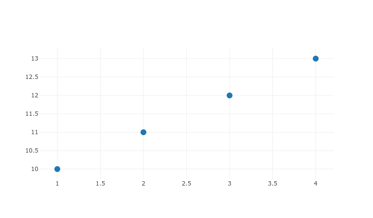

# Table of Contents

1.  [Installation](#org14a3cca)
2.  [Usage - simple plots](#org9ff4b2a)
    1.  [Dotcharts ](#org0f361c4)
    2.  [Barcharts ](#org249f98a)
    3.  [Piechart ](#org83c8411)
    4.  [Heatmap ](#org28c811c)
    5.  [Histograms ](#org313d0f9)
    6.  [Boxplots ](#orgd6681e9)
    7.  [Curves ](#orgcd72d07)
    8.  [Densitymaps](#org5b36d45)
    9.  [Combining charts](#org2ba9e96)
3.  [More complex graphs via `eplotly`](#org05148d4)
    1.  [Create boxplots ](#org0d6c309)
4.  [Subplots](#orgb9089bf)
5.  [Surface plots](#orga401dcc)

This minor mode allows Emacs users to create plots directly from elisp
files, without the need for external programs such as R or gnuplot.
It is a simple (and limited in scope) wrapper around [Plotly](https://plotly.com/).

The main workhorse is the `eplotly` function, which translates
a lisp list into a javascript element, then embeds it into an HTML
file and opens it in a browser: users already familiar with `Plotly`
might prefer to use this function.

The following utility functions can also be used in place of `eplotly`
to create common graphs (they assume some default parameters, thus
simplify the instructions to build plots):

-   **[`eplotly-dot`](#orgc2e9413):** for dotcharts
-   **[`eplotly-bar`](#orge3ccd64):** for barcharts
-   **[`eplotly-pie`](#org0554423):** for pie charts
-   **[`eplotly-hist`](#org810d7b1):** for histograms
-   **[`eplotly-heatmap`](#orge2cb878):** for heatmaps
-   **[`eplotly-box`](#orgdd5468c):** for boxplots
-   **[`eplotly-fun`](#org6f82794):** for plotting curves

# Installation

Place eplotly.el somewhere where Emacs can find it (i.e. it must
be in your load-path), then in .emacs write

(require 'eplotly)

From now on, whenever you are in an elisp file, just do
M-x eplotly-mode and you are able to use its plotting functions.

To make the plot creation faster (and to be able to create plots
when you are not connected to the Internet), we suggest to download
locally a copy of plotly.js, i.e. something like the following:

1.  Get plotly.js from <https://plotly.com/javascript/getting-started/>
    (see the "Download" paragraph) and store it somewere in
    your machine.
2.  Set the variable **plotly-dir** equal to the path of the
    directory where you've downloaded the plotly.min.js file, e.g.
    write in your `.emacs` something like
    
        (setq eplotly-dir "/path/to/plotlyjs/")

# Usage - simple plots

## Dotcharts 

You can plot a dotchart via the `eplotly-dot` function: it accepts one or
more arguments:

-   the first one is a list of one or more lists; each nested list contain
    the data to plot, plus addition parameters (see examples)
-   the rest of the arguments are in the form of :keys and contain parameters
    for the chart layout.

Eg. to plot a series of dots, simply pass a list whose car contains
2 lists, the first one containing the values of the x-coordinates of
the dots, the second one containing the y-values.

    
    (eplotly-dot
     '(((1 2 3 4)
        (10 11 12 13))))

Suppose we want to add a second series of dots, simply add another
nested list with x and y values to the data-series.

    
    (eplotly-dot
     '(
       ((1 2 3 4)
        (10 11 12 13))
    
       ((1 2 3 4)
        (15 15 15 15))
       ))

For each series we can customize various some parameters (these parameters try to
follow the same names used in Plotly). If we want to plot a line that passes
through the dots, we should pass the value "lines" to the key :mode

    (eplotly-dot
     '(((1 2 3 4)
        (10 11 12 13)
       :mode "lines")))

To plot both dots and line, just use :mode "lines+markers":

    
    (eplotly-dot
     '(((1 2 3 4)
        (10 11 12 13)
       :mode "lines+markers"
       )))

The following are some of the keys that you can use for each data seris:

-   **:name:** name of the series
-   **:size:** size of the dots; if a single number is passed, that will be
    used for all dots; if a list of values is passed, those will be used as
    size for every single plot (in this case, make sure that you pass a size
    value for every single plot, i.e. the lenght of the :size list should be
    the same as the lenght of the x and y values).
-   **:color:** like :size, you can pass a single value (either a color name or a
    string represening rgb values - see examples) that will be used for all points
    or a series of colors, one for each point.
-   **:symbol:** the symbol to be used to represent the dots.

To set the title of the chart, you can set the keyword :title (Nota Bene:
this has to be set 'outside' the list of data series - please note the
parenthesis in the following examples):

    
    (eplotly-dot
     '(
       ;; first series of data to plot
       ((1 2 3) (3 3 3) :mode "markers"
        :size (20 30 40) :color "blue")
       ;; second series
       ((1 2 3) (5 2 1) :mode "lines" :text '("A" "B" "C"))
       ;; third series
       ((1 2 3) (5 5 8) :mode "lines+markers" :name "Team C" :size 20))
     ;; layout parameters
     :title "My first plots"
    :xlim '(0 4) :ylim '(0 10))

You can also customize the color and the shape of each dot in a data-series
via the :color and :symbol keys.

    
    (eplotly-dot
     '(((1 2 3 4)
        (10 11 12 13)
        :size (10 20 30 30)
        :color ("rgb(93 164 214)" "rgb(255 144 14)"  "rgb(44 160 101)" "rgb(255 65 54)")
        :symbol  ("circle" "square" "diamond" "cross")))
    
     :title "Using eplotly-dot elisp function")

## Barcharts 

To create a barchart you need to pass lists of data for every series of bars.
Each series should be composed of:

-   a first list of labels for each bar
-   a second list of values representing the height of each bar
-   (optional) name of the series (set via the :name key)

Then - after the data series - we can also pass the following values:

-   **:barmode:** if set to "stack", the bars are stacked
-   **:title:** title of the chart

    (eplotly-bar '(
                ;; first series of bars
                (
                 ;; series of labels for the bars
                 ("giraffes" "orangutans" "monkeys")
                 ;; height of the bars
                 (20 14 23)
                 ;; name of the series
                 :name "SF Zoo")
                ;; second series od bars
                (("giraffes" "orangutans" "monkeys")
                 (12 18 29)
                 :name "LA Zoo"))
              :barmode  "stack"
              :title "Simple Barcharts")

You can also add text to each bar via the :text keyword:

    
    (eplotly-bar '((
                 ("Liam" "Sophie" "Jacob" "Mia" "William" "Olivia")
                 (8.0 8.0 12.0 12.0 13.0 20.0)
                 :text  ("4.17 below the mean" "4.17 below the mean" "0.17 below the mean" "0.17 below the mean" "0.83 above the mean" "7.83 above the mean"))
                ))

The angle of the text at the tick marks can be rotated via the :tickangle parameter:

    (eplotly-bar  '((("Liam" "Sophie" "Jacob" "Mia" "William" "Olivia")
              (8.0 8.0 12.0 12.0 13.0 20.0)
              :text  (8.0 8.0 12.0 12.0 13.0 20.0)))
           :tickangle -45)

## Piechart 

To create a simple pie chart, pass a data series whose elements
are

-   values for each slice of the piechart
-   labels for each slice of the piechart

    (eplotly-pie
        '(
          ((30 20 50)
           ("Residential" "Non-Residential" "Utility")
           )))

To create a doughnut chart, simply include the additiona parameter
'hole in the alist (its value should be comprised between
0 and 1):

    (eplotly-pie
        '(
          ((16 15 12 6 5 4 42)
           ("US" "China" "European Union" "Russian Federation"
                      "Brazil" "India" "Rest of World" )
           :hole .7
           :name "GHG Emissions")
           ))

## Heatmap 

To build a heatmap you need to pass an alist with car equal to 'z and cdr equal to a
a nested list built according to the following criteria:

-   each nested list contains the data of a row (first nested list represents
    the first row at the bottom of the heatmap, the last nested list represents
    the row at the top of the heatmap).
-   Each value in each nested list represents the value of a cell of the
    heatmap (cells are represented from left to right)
    
    I.e. to obtain the following heatmap

<table border="2" cellspacing="0" cellpadding="6" rules="groups" frame="hsides">

<colgroup>
<col  class="org-right" />

<col  class="org-right" />

<col  class="org-right" />

<col  class="org-right" />
</colgroup>
<tbody>
<tr>
<td class="org-right">1</td>
<td class="org-right">2</td>
<td class="org-right">3</td>
<td class="org-right">4</td>
</tr>

<tr>
<td class="org-right">5</td>
<td class="org-right">6</td>
<td class="org-right">7</td>
<td class="org-right">8</td>
</tr>

<tr>
<td class="org-right">9</td>
<td class="org-right">10</td>
<td class="org-right">11</td>
<td class="org-right">12</td>
</tr>
</tbody>
</table>

you should use the following nested list:

'((9 10 11 12) (5 6 7 8) (1 2 3 4))

    
    (eplotly-heatmap
            '((
               ((1 20 30 50 1) (20 1 60 80 30) (30 60 1 -10 20)))))

If you want to add labels to the x and y axis, just set the
:x and :y parameters with list containing the labels (pay
attention to the lenght of each list, which should correspond
to the size of the heatmap, i.e. the length of the :x list should
be equal to the number of columnts of the map, while the
length of the :y list should be equal to the number of rows):

    
    (eplotly-heatmap
     '((
        ((1 20 30 50 1) (20 1 60 80 30) (30 60 1 -10 20))
        :x ("Monday" "Tuesday" "Wednesday" "Thursday" "Friday")
        :y ("Morning" "Afternoon" "Evening"))))

## Histograms 

To plot histograms you can use the function `eplotly-hist`

    (eplotly-hist
     '(((1 2 2 2 1 1 1 4 4 4)
        )))

By default the bars are plotted vertically; to have horizontal
bars, set the key :direction to "horizontal";

    (eplotly-hist
     '(((1 2 2 2 1 1 1 4 4 4)
        :direction "horizontal"
        )))

For a stacked histogram, pass two or more series as a first argument,
then, then pass the :barmode key set to "stack".

    (eplotly-hist
     '(((1 2 2 2 1 1 1 4 4 4))
       ((3 3 2  1 1 1 5 5 5 )))
     :barmode "stack")

## Boxplots 

For vertical boxplots, pass lists of data for each box

    
    (eplotly-box
     '((
        (1 2 2 2 1 1 1 4 4 4 10 -5))
       ((3 3 2  1 1 1 5 5 5 ))))

You can specify the names of each box, by using the :name key

    
    (eplotly-box
     '((
        (1 2 2 2 1 1 1 4 4 4 10 -5)
        :name "first")
       ((3 3 2  1 1 1 5 5 5 )
        :name "second")))

For horizontal boxplots, set the :direction key to "horizontal"

    
    (eplotly-box
     '((
        (1 2 2 2 1 1 1 4 4 4 10 -5)
        :name "first"
        :direction "horizontal")
       ((3 3 2  1 1 1 5 5 5 )
        :name "second"
        :direction "horizontal"))
     )

**Grouped boxplots**: for grouped boxplots it is more convenient to
use the **simplot** function (see [3.1](#org34a1411) paragraph)

## Curves 

You can plot curves using the `eplotly-fun` and passing one or more function
definitions.

For each curve the following parameters should be provided:

-   a function to plot; this can be the name of a function already
    available or a lambda function (NOTA BENE: if you pass a lambda,
    that should not quoted nor be preceeded by #' (i.e.
           (lambda(x)(+ x 2) : is good
         #'(lambda(x)(+ x 2) : is bad
          '(lambda(x)(+ x 2) : is bad
-   minimum value for the x-value of the function
-   maximum value for the x-value of the function
-   :step (optional) : distance between one dot and the next (the smaller this
    value, the smoother the curve will appear). By default
    this is set to 1/20 of the range between xmin and xmax.
-   :color (optional): color of the curve
-   :dash : can either be 'solid', 'dash', 'dot' or 'dashdot'
-   :width: width of the line
-   :name : name of the curve
-   :mode: default to 'lines' in order to plot a line

E.g. let's play a parabola with equation $y = 3 x^2 + 5 * x$ from -10 to 10:

    
    (eplotly-fun
     '(
       ((lambda(x)  (+ (* 3 x x) (* 5 x))) -10 10)))

..let's add a line ($y = 10 * x + 3$) in green color and dotted line:

    (eplotly-fun
     '(
       ((lambda(x)  (+ (* 3 x x) (* 5 x))) -10 10 :name "Parabola")
       ((lambda(x)  (+ (* 10 x) 3)) -10 10 :color "green"
        :dash "dot" :name "Line")
        )
       )

Let's try a more complex example: we want to plot the parabola
$y = 3 * x^2 + 5 * x$ and its tangent lines at points with x=-5
and x=3.

Let's define the following functions:

    
    (defun parabola(x)
      "Our parabola"
      (+ (* 3 x x) (* 5 x)))
    
    (defun parabola-deriv(x)
      "The derivative of our parabola."
      (+ (* 6 x) 5))
    
    (defun tangent-at(fun fun-deriv val)
      "Return the tangent line of FUN at VAL point.
    "
      (let*
          (
           ;; Px is the x-value at which we want to find
           ;; the tangent line
           (Px val)
           ;; Py is the value of function at Px
           (Py (funcall fun Px))
           ;; m is the slope of the tangent
           ;; curve at Px
           (m (funcall fun-deriv val))
           ;; b is the intercept of the
           ;; tangent curve at Px
           (b (- Py (* m Px)))
           )
        `(lambda(z)(+ (* ,m z) ,b))))

We can now plot the parabola and the 2 tangent curves:

          (let*
              ((xmin -10)
               (xmax 10))
    
            (eplotly-fun `(
                           ;; plot the parabola
                           (parabola ,xmin ,xmax :color "red" :name "parabola" :dash "solid")
                           ;; plot the tangen at x=3
                           (,(tangent-at #'parabola #'parabola-deriv 3) ,xmin ,xmax
                            :color "green" :name "Tangent at 3" :dash "dash")
                           ;; plot the tangent at -5
                           (,(tangent-at #'parabola #'parabola-deriv -5) ,xmin ,xmax
                            :color "blue" :name "Tangent at -5" :dash "dash")
                           ;; let's plot the tangent points
                           (parabola 3 3 :mode "markers" :name "Tangent point at 3" :color "green")
                           (parabola -5 -5 :mode "markers" :name "Tangent point at -5"
                                     :color "blue")
                           )
                         :title "Parabola and some tangents"
    ;;      :ylim '(-10 80)
            ))

Please note the following:

-   the nested list passed to eplotly-fun is *backquoted* so that the
    calls to `tangent-at` can be evaluated via the "," which is
    prepended to them
-   We used a little trick to plot the dots:
    -   the parabola function was passes (so that it automatically
        gets the right y value)
    -   the range of the parabola is limited to the point we want
        to plot (i.e. "from 3 to 3" or "from -5 to -5)
    -   we pass the argument :mode "markers" so that dots are
        plotted instead of lines.

## Densitymaps

In the case of densitymap, all parameters passed for the plots are in
the form of key/value(s); the following parameters are accepted:

-   LON: list or vector of longitude values
-   LAT: list or vector of latitude values
-   Z: list or vector of values for each lat/lon point
-   NAME: name of the curve
-   MODE: default to 'densitymap' in order to plot a line
-   TEXT: text associated to the series
-   RADIUS: radius for the densitymap plot
-   YANCHOR: where should the legendbar be shown
-   LEN: length of the legendbar"

    
    (eplotly-densitymap
     '((:lon [10 20 30] :lat [15 25 30] :z [1 2 3])
       (:lon [25 35 45 ] :lat [5 10 20] :z [1 2 3]))
      :coloraxis  '((colorscale . "Viridis")))  

## Combining charts

You can combine different charts using `eplotly-combine`, which accepts the
following arguments:

-   a nested list of various eplotly plotting functions
-   a series of layout parameters.

Eg, suppose we want to combine the followig charts:

-   some functions (e.g. the parabola and and tangent drawn in a previous
    paragraph; please load the code chunks in [Curves paragraph](#org6f82794) to run this
    example, since you will need a few functions defined there)
-   some dots, created via the eplotly-dot functions
-   some shapes (i.e. a circle and a rectangle).

We could wrap all these function calls into a list and then pass it to the
`eplotly-combine` function like in the following example:

       (eplotly-combine
    
    `(
      (eplotly-fun (  
             ((lambda(x)(+ (* 3 x x) (* 5 x))) -10 10 :color "red" :name "parabola" :dash "solid")
             (,(tangent-at #'parabola #'parabola-deriv 3) -10 10
              :color "green" :name "Tangent at 3" :dash "dash")
             (parabola 3 3 :mode "markers" :name "Tangent point at 3" :color "green")
             (parabola -5 -5 :mode "markers" :name "Tangent point at -5"
                       :color "blue")
             )
            ;; (boh 0 100 :dash "dot" :color "blue" :mode "markers")
            :title "Parabola and some tangents")
    
      (eplotly-dot
       (([-8 -4 0 4 8] [20 20 20 20 20 ]
         :name "Some points")))
    
      (eplotly-shapes
       ((
         :type "circle"
         :xref "x" 
         :yref "y" 
         :x0 -7; "2015-02-04" 
         :y0 40 
         :x1 -3;"2015-02-06" 
         :y1 60 
         :fillcolor "#d3d3d3" 
         :opacity 0.2)
    
        (
         :xref "x" 
         :yref "y" 
         :x0 1; "2015-02-04" 
         :y0 15 
         :x1 5;"2015-02-06" 
         :y1 80 
         :fillcolor "#d3d3d3"
         ;; :label ((text . "prova"))
         :text "My shape"
         ;; :textposition "end"
         :fontsize 20
         :opacity 0.2)
        )
       :name "some rectangles"))
    )

# More complex graphs via `eplotly`

The above mentioned functions are just wrappers for the function `eplotly`
which can be used to create more complicated plots and allows for additional
fine tunings of those plots.

This function accepts 2 arguments:

1.  the first is a series of one or more alists; each alist follows the structure
    of the javascript code used by plotly.js; heare are some example of its usage
     (please refer to the potly javascript documentation to see all the avaiable
     parameters - though it is not guaranteed that `eplotly` will accept
      all such parameters).
2.  a second (optional) alist of parameters determining the `layout` of the chart.

    (eplotly
      '(
        ((x 1 2 3 4 5)
         (y . (1 6 3 6 1))
         (mode . "markers+text")
         (type . "scatter")
         (name .  "Team A")
         (text . ("A-1" "A-2" "A-3" "A-4" "A-5"))
         (textposition . "top center")
         (textfont . ((family . "Raleway, sans-serif")))
         (marker . ((size . 12))))
    
        ((x . (1.5 2.5 3.5 4.5 5.5))
         (y . (4 1 7 1 4))
         (mode . "markers+text")
         (type . "scatter")
         (name . "Team B")
         (text . ("B-a" "B-b" "B-c" "B-d" "B-e"))
         (textfont . ((family . "Times New Roman")))
         (textposition . "bottom center")
         (marker . (( size . 12 ))))
        )
      '((xaxis . ((
                   range . (-2 10 ))))
        (yaxis . ((range . (0 8))))
        (legend . ((y . 0.5)
                   (yref . "paper")
                   (font . (
                            (family . "Arial sans-serif")
                            (size . 20)
                            (color . "grey")
                            ))))
        (title . ((text . "Data Labels on the Plot"))))
      )

Create a basic barchart with `eplotly`:

    (eplotly (list '((x . ("giraffes" "orangutans" "monkeys"))
                    (y . (20 14 23))
                    (type . "bar")))
            '((title . "Barchart")))

Create a grouped barchart with `eplotly`:

    (eplotly (list '((x . ("giraffes" "orangutans" "monkeys"))
                  (y . (20 14 23))
                  (name . "SF Zoo")
                  (type . "bar")
                  )
                '((x . ("giraffes" "orangutans" "monkeys"))
                  (y . (12 18 29))
                  (name . "LA Zoo")
                  (type . "bar"))
                )
          '((barmode . "group"))
          )

Create a stacked barchart with `eplotly`:

    
    
    ;; stacked
    (eplotly (list '((x . ("giraffes" "orangutans" "monkeys"))
                       (y . (20 14 23))
                       (name . "SF Zoo")
                       (type . "bar")
                       )
                     '((x . ("giraffes" "orangutans" "monkeys"))
                       (y . (12 18 29))
                       (name . "LA Zoo")
                       (type . "bar"))
                     )
               '((barmode . "stack")
                 (autosize . "false")
                 (width . 500)
                 (height . 500)
                 (title . ((text . "see"))))
               )

Create a scatter Plot with a Color Dimension

    
    (eplotly
     '(((y . (5 5 5 5 5 5 5 5 5 5 5 5 5 5 5 5 5 5 5 5 5 5 5 5 5 5 5 5 5 5 5 5 5 5 5 5 5 5 5 5))
        (mode . "markers")
        (marker . ((size . 40)
                   (color . (0 1 2 3 4 5 6 7 8 9 10 11 12 13 14 15 16 17 18 19 20 21 22 23 24 25 26 27 28 29 30 31 32 33 34 35 36 37 38 39))
                   )))))

Set up colors, symbol and other parameters for a dotchart:

    (eplotly
      '(
        ((x 1 2 3 4)
         (y . (10 11 12 13))
         (mode . "markers")
         (type . "scatter")
         (marker . ((size . (40 60 80 100))
                    (color . ("rgb(93 164 214)" "rgb(255 144 14)"  "rgb(44 160 101)" "rgb(255 65 54)"))
                    (symbol . ("circle" "square" "diamond" "cross"))
                    )))))

Create a piechart:

    (eplotly
        '(
          ((values . (30 20 50))
           (labels . ("Residential" "Non-Residential" "Utility"))
           (type . "pie")
           )))

Create a doughnut chart:

    (eplotly
        '(
          ((values  16 15 12 6 5 4 42)
           (labels . ("US" "China" "European Union" "Russian Federation"
                      "Brazil" "India" "Rest of World" ))
           (type . "pie")
           (hoverinfo . "label+percent+name")
           (hole . .7)
           (name . "GHG Emissions")
           )))

Create a heatmap:

    (eplotly
          '((
             (z . ((1 20 30 50 1) (20 1 60 80 30) (30 60 1 -10 20)))
             (x . ("Monday" "Tuesday" "Wednesday" "Thursday" "Friday"))
             (y . ("Morning" "Afternoon" "Evening"))
             (type . "heatmap"))
            ))

Create histograms

    (eplotly
     '(((y . (1 2 2 2 1 1 1 4 4 4))
        (type . "histogram"))))

For a stacked histogram, pass two or more series as a first argument,
then, as a second argume (containing the layout settings) include
an alist with values (barmode . "stack").

    (eplotly
     '(((x . (1 2 2 2 1 1 1 4 4 4))
        (type . "histogram")
        )
       ((x . (3 3 2  1 1 1 5 5 5 ))
        (type . "histogram")
        ))
     '((barmode . "stack")))

## Create boxplots 

For vertical boxplots, pass alists with car equal to 'y and 'type equal to "box":

    
    (eplotly
     '(((y . (1 2 2 2 1 1 1 4 4 4 10 -5))
        (type . "box"))
       ((y . (3 3 2  1 1 1 5 5 5 ))
        (type . "box"))))

For horizontal boxplots, use 'x instead of 'y in the data-series
nested list.

    
    (eplotly
     '(((x . (1 2 2 2 1 1 1 4 4 4 10 -5))
        (type . "box"))
       ((x . (3 3 2  1 1 1 5 5 5 ))
        (type . "box"))))

Let's create a plot similar to the one in Plotly-javascript tutorial:

      (defun random-list(n upper-limit)
        "Convenience function to create a list
    of random numbers."
        (let*
            ((res '()))
          (dotimes (x n)
            (push (random upper-limit) res))
          (reverse res))
        )
    
      (eplotly
       `(((y . ,(random-list 30 10))
          (type . "box"))
         ((y . ,(random-list 30 11))
          (type . "box"))))

To include the underlying dots, add:

-   (boxpoints . "all")
-   (jitter . 0.3)
-   (pointpos . -1.8)
    
    to the data series (of course these are just the same values
    used in the javascript tutorial, you are supposed to use the
    most appropriate values for your plot).

    
    (eplotly
     '(((y . (1 2 2 2 1 1 1 4 4 4 10 -5))
    
        (boxpoints . "all")
        (jitter . 0.3)
        (pointpos . -1.8)
        (type . "box"))
       ((y . (3 3 2  1 1 1 5 5 5 ))
        (type . "box"))))

**Grouped boxplots**: for each data series, pass both y values (the data
from which the box should be built) and x values (labels that represent
the group to which each y-value belongs to).

    (setq days
          '("day 1" "day 1" "day 1" "day 1" "day 1" "day 1"
    
             "day 2" "day 2" "day 2" "day 2" "day 2" "day 2"))
    
    
    (eplotly
     `((
        (y . [0.2 0.2 0.6 1.0 0.5 0.4 0.2 0.7 0.9 0.1 0.5 0.3])
        (x . ,days)
        (name . "kale")
        ;; marker: {color: "#3D9970"}
        (type . "box"))
       ((y . [0.6 0.7 0.3 0.6 0.0 0.5 0.7 0.9 0.5 0.8 0.7 0.2])
        (x . ,days)
        (name . "radishes")
        ;; marker: {color: "#FF4136"}
        (type . "box")
        )
       (
        (y . [0.1 0.3 0.1 0.9 0.6 0.6 0.9 1.0 0.3 0.6 0.8 0.5])
        (x . ,days)
        (name . "carrots")
        ;; marker: {color: "#FF851B"}
        (type . "box")))
     '((boxmode . "group")))

# Subplots

You need to pass a second argument to the eplotly function (an
alist containing the layout parameters) where you need to set
the number of rows and columns, i.e. something like the
following will create a 2\*2 grid of charts

'(( grid .
    ((rows . 2)
     (columns . 2)
     (pattern .  "independent"))))

    (eplotly
     '((
        (  x . [1 2 3])
        (  y . [4 5 6])
        (type . "scatter"))
       ((x . [20 30 40])
        (y . [50 60 70])
        (xaxis . "x2")
        (yaxis . "y2")
        (type . "scatter"))
       (
        (x . [300 400 500])
        (y . [600 700 800])
        (xaxis . "x3")
        (yaxis . "y3")
        (type . "scatter"))
       (
        (x . [4000 5000 6000])
        (y . [7000 8000 9000])
        (xaxis . "x4")
        (yaxis . "y4")
        (type . "scatter")
        ))
     '(( grid .
         ((rows . 2)
          (columns . 2)
          (pattern .  "independent")))))

# Surface plots

Pass an alist with car equal z and cdr a nested list of
height values, and another one with car equal 'type
and cdr equal "surface").

    (eplotly
     '((
        (z .    ((8.83 8.89 8.81 8.87 8.9 8.87) 
                 (8.89 8.94 8.85 8.94 8.96 8.92) 
                 (8.84 8.9 8.82 8.92 8.93 8.91) 
                 (8.79 8.85 8.79 8.9 8.94 8.92) 
                 (8.79 8.88 8.81 8.9 8.95 8.92) 
                 (8.8 8.82 8.78 8.91 8.94 8.92) 
                 (8.75 8.78 8.77 8.91 8.95 8.92) 
                 (8.8 8.8 8.77 8.91 8.95 8.94) 
                 (8.74 8.81 8.76 8.93 8.98 8.99) 
                 (8.89 8.99 8.92 9.1 9.13 9.11) 
                 (8.97 8.97 8.91 9.09 9.11 9.11) 
                 (9.04 9.08 9.05 9.25 9.28 9.27) 
                 (9 9.01 9 9.2 9.23 9.2) 
                 (8.99 8.99 8.98 9.18 9.2 9.19) 
                 (8.93 8.97 8.97 9.18 9.2 9.18)))
        (type . "surface"))))

Plot a densitymap

     (eplotly
    '((
       (type . "densitymap")
       (lon . [10 20 30])
       (lat . [15 25 35])
       (z . [1 3 2])
       (radius . 50)
       (coloraxis . "coloraxis")
       (colorbar .
                 ((y . 1)
                  (color . "green")
                  (yanchor .  "top")
                  (len . 0.45)))))
    '((coloraxis . ((colorscale . "Viridis")))))

